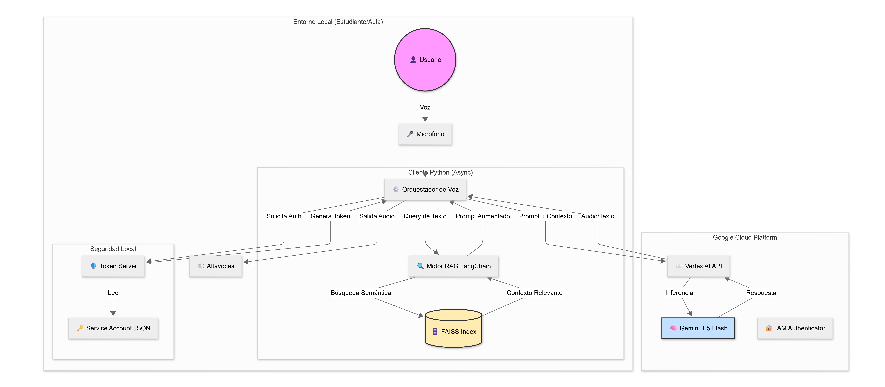
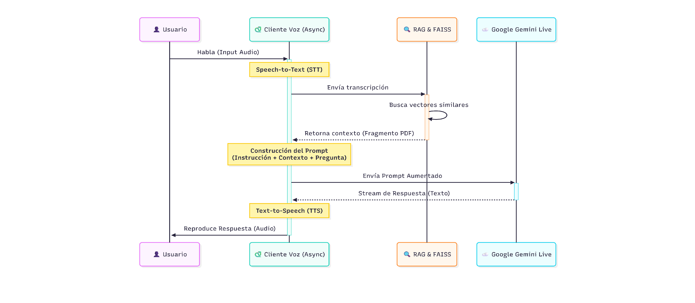

<h1 align="left">Sabio Huesos AI</h1>

<p align="left">
  A Socratic AI Tutor powered by RAG and Google Gemini.
</p>


## Features

* Socratic Engine: Unlike standard LLMs, it guides users via questions rather than answers.
* RAG Architecture: Retrieval-Augmented Generation using local PDF vector stores to reduce hallucinations.
* Real-time Voice I/O: Asyncio-based audio streaming for low-latency conversation.
* Secure Auth: Token-based middleware (`token_server.py`) to protect Google Cloud credentials.
* Test on: Windows.

---

## Technical Architecture

### 1. System Overview
High-level component interaction between the Local Environment (Student/Classroom) and Google Cloud Platform. Note the **Token Server** middleware ensuring security by isolating credentials from the client.

<div align="center">
  
  <br>
  <sub><i>Fig 1. Architecture: Python Async Client, Local Security Layer, and Vertex AI Integration.</i></sub>
</div>

<br>

### 2. RAG Inference Workflow
The "Socratic Brain" logic. This sequence diagram illustrates how the system intercepts the user's voice, retrieves context from the vector store (FAISS), and constructs an augmented prompt before generating a response.

<div align="center">
  
  <br>
  <sub><i>Fig 2. Execution Pipeline: Speech-to-Text -> Vector Retrieval -> Prompt Engineering -> TTS.</i></sub>
</div>

---

## Installation

### Prerequisites

* Python 3.9 or higher.
* Google Cloud Project with **Vertex AI API** enabled.
* `portaudio` (usually required for PyAudio).

### Manual Installation

#### Linux / macOS
 
### 1. Clone the repo
```Bash
git clone [https://github.com/EzequielLasnier/sabio-huesos-ai-tutor.git](https://github.com/EzequielLasnier/sabio-huesos-ai-tutor.git)
cd sabio-huesos-ai-tutor
```
### 2. Setup Environment (Automated script)
```Bash
chmod +x setup_linux.sh
./setup_linux.sh
```
### 3. Activate
```Bash
source venv/bin/activate
```

#### Windows (PowerShell)

### 1. Clone
```Bash
git clone [https://github.com/EzequielLasnier/sabio-huesos-ai-tutor.git](https://github.com/EzequielLasnier/sabio-huesos-ai-tutor.git)
cd sabio-huesos-ai-tutor
```
### 2. Create Venv & Install
```Bash
python -m venv venv
.\venv\Scripts\activate
pip install -r requirements.txt
```
### Configuration
Sabio Huesos is configured via file structure and environment keys, aiming for a "privacy-first" approach.

1. Google Cloud Credentials
You must place your Service Account Key in the root directory.

File Name: service-account-key.json

Required Role: Vertex AI User

2. Knowledge Base
To update the RAG context, simply replace the PDF file. The system will rebuild the FAISS index automatically on the next run.

```Bash
/data
 └── anatomia_huesos.pdf  <-- Replace this file to change the subject
```
#### Usage
The system operates with a Client-Server architecture to handle authentication securely.

### Step 1: Start the Token Server
In the first terminal window:
```Bash
python token_server.py
```
Output: Serving on localhost:8000

### Step 2: Start the Voice Client
In a second terminal window:
```Bash
python voice_gemini_bot.py
```
Output: Listening...

## Command Line Flags (Future Roadmap)
Currently, configuration is static, but future releases will support CLI flags similar to:

--input-device <id>: Select microphone ID.

--latency <ms>: Adjust buffer size.

--mode <socratic|direct>: Toggle teaching style.

## Troubleshooting
#### Common Issue: ImportError: cannot import name 'genai'

This is usually a conflict in the Python environment.

Quick Fix
```Bash
pip uninstall google-generativeai
pip install google-generativeai
```

## Contribution
Contributions are welcome! 
